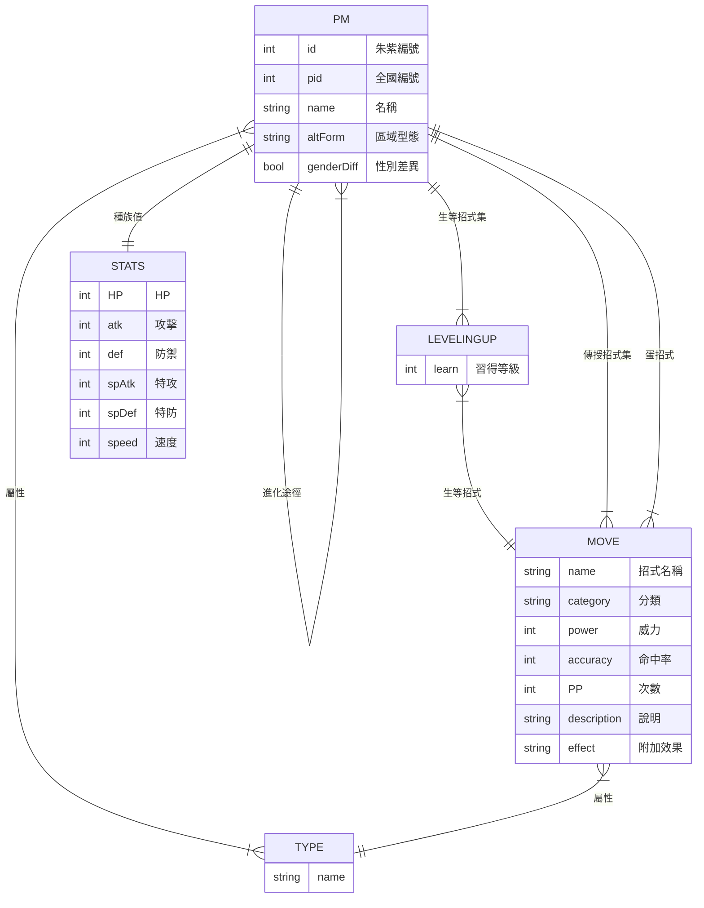

```mermaid
erDiagram
    PM {
        int id "朱紫編號"
        int pid "全國編號"
        string name "名稱"
        string altForm "區域型態"
        bool genderDiff "性別差異"
    }
    TYPE {
        string name
    }
    MOVE {
        string name "招式名稱"
        string category "分類"
        int power "威力"
        int accuracy "命中率"
        int PP "次數"
        string description "說明"
        string effect "附加效果"
    }
    LEVELINGUP {
        int learn "習得等級"
    }
    STATS {
        int HP "HP"
        int atk "攻擊"
        int def "防禦"
        int spAtk "特攻"
        int spDef "特防"
        int speed "速度"
    }
    PM }|--|{ TYPE : "屬性"
    MOVE }|--|| TYPE : "屬性"
    LEVELINGUP }|--|| MOVE : "生等招式"
    PM ||--|{ LEVELINGUP : "生等招式集"
    PM ||--|{ MOVE : "傳授招式集"
    PM ||--|{ MOVE : "蛋招式"
    PM ||--|| STATS : "種族值"
    PM ||--|{ PM : "進化途徑"
```
